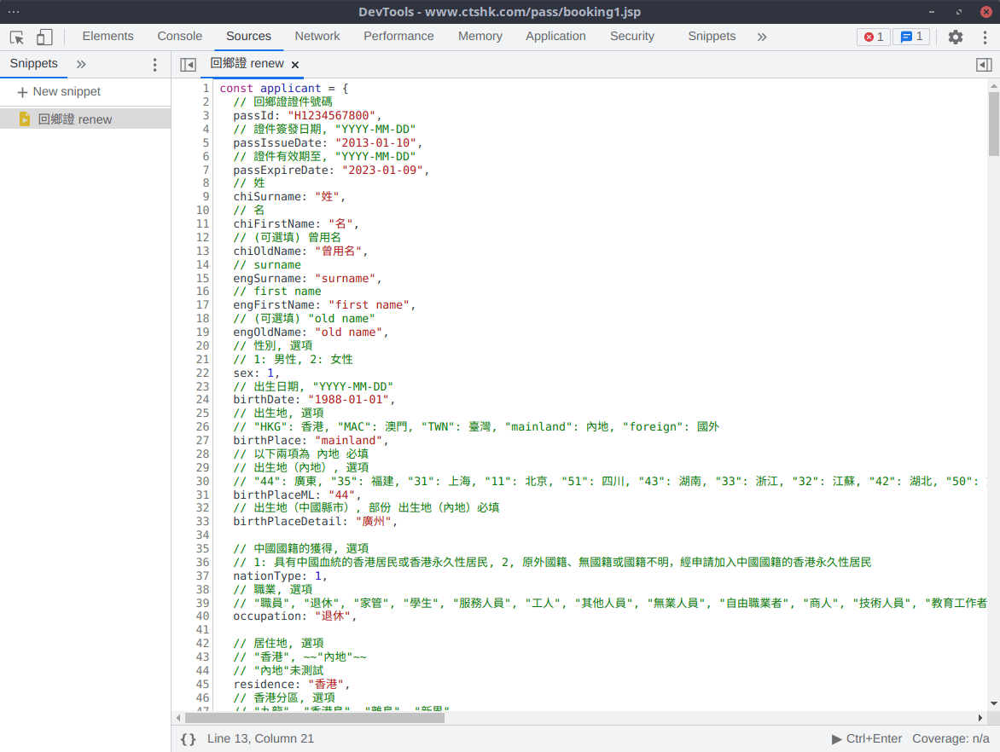
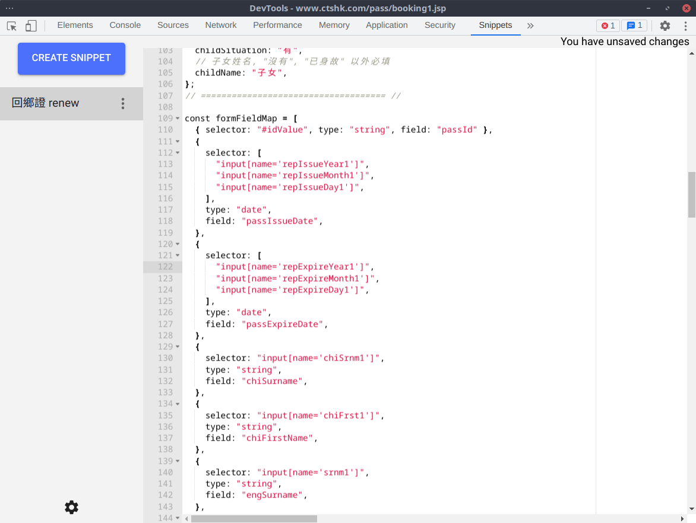

# 中旅社回鄉證自動填表工具

《港澳居民來往內地通行證》（回鄉證）已實施全面網上預約及網上填表，每晚十二點更新名額，但很快就被一掃而空。  
本程序為自動填表工具，加速填表過程，希望可以增加預約成功率。

[中國旅行社 - 預約申領回鄉卡](https://www.ctshk.com/pass/bookterms.jsp)

## Usage

> 現時只支持申請類別為"到期換發《港澳居民來往內地通行證》"流程

- 進入"預約辦理《港澳居民來往內地通行證》"頁面 (`https://www.ctshk.com/pass/booking1.jsp`)
- 把申請人資料填到`renew.js` `applicant` 變量中
- 注意有些項目會因應選項而增減，建議第一次以手動填表
- 用以下其中一個方法把`renew.js` 以 Snippet 型式在 "預約辦理《港澳居民來往內地通行證》"執行
- 表格應該會按`applicant` 變量填好，可以"下一步"選擇辦理中心
- 如有問題請提交 Issue

### 1. Snippets in Chrome

[Run snippets of JavaScript - Chrome Developers](https://developer.chrome.com/docs/devtools/javascript/snippets/)

### 2. Snippets Extension

> Note: this extension uploads your snippets to a private Gist

[Snippets - Chrome Web Store](https://chrome.google.com/webstore/detail/snippets/fakjeijchchmicjllnabpdkclfkpbiag/related)

